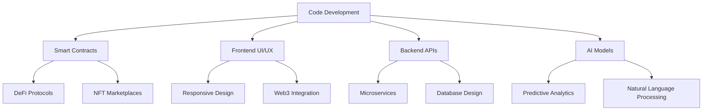

# 👋 Hi, I'm **The Big GOAT** 🐐

[](https://git.io/typing-svg)

<div align="center">


</div>

## 🚀 **About Me**

```javascript
const theBigGOAT = {
  pronouns: "he" | "him",
  code: ["Solidity", "Rust", "TypeScript", "Python", "Go", "C++"],
  technologies: {
    blockchain: ["Ethereum", "Solana", "Polygon", "Avalanche", "Cosmos"],
    web3: ["Hardhat", "Truffle", "Web3.js", "Ethers.js", "Wagmi"],
    frontend: ["React", "Next.js", "Vue", "Three.js", "WebGL"],
    backend: ["Node.js", "Express", "FastAPI", "GraphQL", "PostgreSQL"],
    ai_ml: ["TensorFlow", "PyTorch", "OpenAI", "LangChain", "HuggingFace"],
    devOps: ["Docker", "Kubernetes", "AWS", "GCP", "CI/CD"],
    tools: ["Git", "Linux", "VSCode", "Remix", "Foundry"]
  },
  architecture: ["Microservices", "Serverless", "DDD", "Event-Driven"],
  currentFocus: "Building revolutionary DeFi protocols & AI-powered dApps",
  funFact: "I can debug production issues while sleeping 😴"
};
```

## 🛠 **Technical Arsenal**

### **Blockchain & Web3**
<div align="center">


</div>

### **AI & Machine Learning**
<div align="center">


</div>

### **Frontend Mastery**
<div align="center">


</div>

### **Backend & DevOps**
<div align="center">


</div>

## 📊 **GitHub Analytics**

<div align="center">
  


</div>

## 🎯 **Featured Projects**

### 🤖 **AI-Powered Blockchain Projects**

| Project | Description | Tech Stack |
|---------|-------------|------------|
| **NeuroChain** | Decentralized AI model marketplace with on-chain inference | Python, Solidity, IPFS, TensorFlow |
| **SmartAudit AI** | AI-driven smart contract vulnerability detection | Rust, ML, Blockchain, Security |
| **Predictive DeFi** | Machine learning for yield farming optimization | PyTorch, Web3, Data Science |

### 🌐 **Web3 & dApps**

| Project | Description | Tech Stack |
|---------|-------------|------------|
| **GoatSwap** | Advanced DEX with concentrated liquidity & MEV protection | Solidity, React, Graph Protocol |
| **NFT Genesis** | Generative NFT platform with dynamic metadata | Hardhat, Next.js, Three.js |
| **DeFi Vaults** | Yield aggregator with cross-chain capabilities | TypeScript, Node.js, Multi-chain |

### 💻 **Full Stack Applications**

| Project | Description | Tech Stack |
|---------|-------------|------------|
| **Enterprise Dashboard** | Real-time analytics with WebGL visualizations | Vue, D3, WebSocket, Microservices |
| **Cloud Native Platform** | Scalable backend with event-driven architecture | Go, Kubernetes, Redis, PostgreSQL |
| **Real-time Collaboration** | WebRTC based collaborative workspace | Socket.io, React, MediaStream API |

## 🏆 **Achievements & Metrics**

<div align="center">


</div>

## 📈 **Development Activity**



## 🎨 **Design Philosophy**

```css
.developer-mindset {
  clean-code: "Always write code as if the next developer is a psychopath who knows where you live";
  performance: "If it doesn't need to be fast, make it fast anyway";
  security: "Trust no one, verify everything";
  innovation: "Break things, but have a rollback plan";
  learning: "The day you stop learning is the day you become obsolete";
}
```

## 🔥 **Current Focus & Learning**

- **Advanced Zero-Knowledge Proofs** (ZK-SNARKs, ZK-STARKs)
- **Quantum-Resistant Cryptography**
- **Decentralized AI Orchestration**
- **Cross-Chain Interoperability Protocols**
- **Real-time 3D Web Applications**

## 📫 **Let's Connect & Collaborate**

<div align="center">

[](https://twitter.com/thebiggoat)
[](https://linkedin.com/in/thebiggoat)
[](https://thebiggoat.dev)
[](mailto:hello@thebiggoat.dev)

</div>

## 💡 **Random Dev Quote**

<div align="center">


</div>

---

<div align="center">

### ⚡ **"Code is like humor. When you have to explain it, it's bad."** ⚡

**Thanks for visiting!** Feel free to check out my repositories and don't hesitate to reach out for collaborations or just a tech chat! 🚀


</div>
